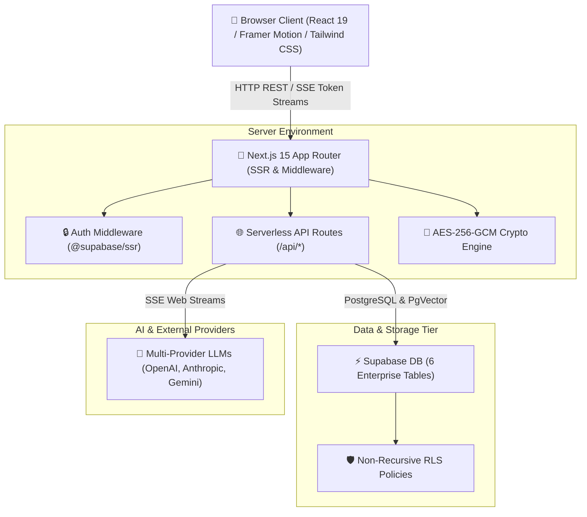
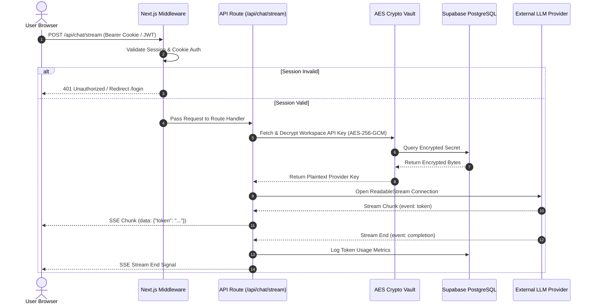
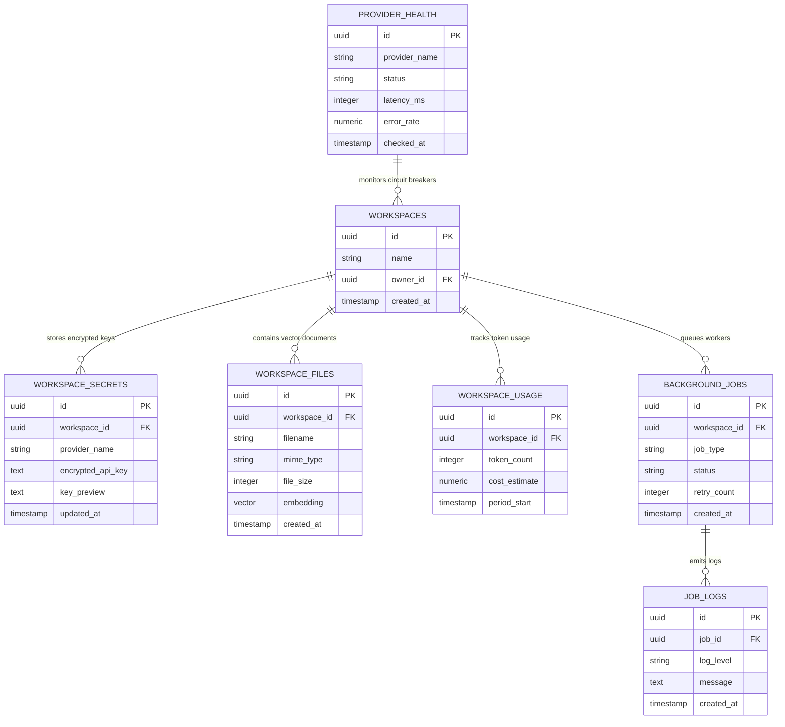
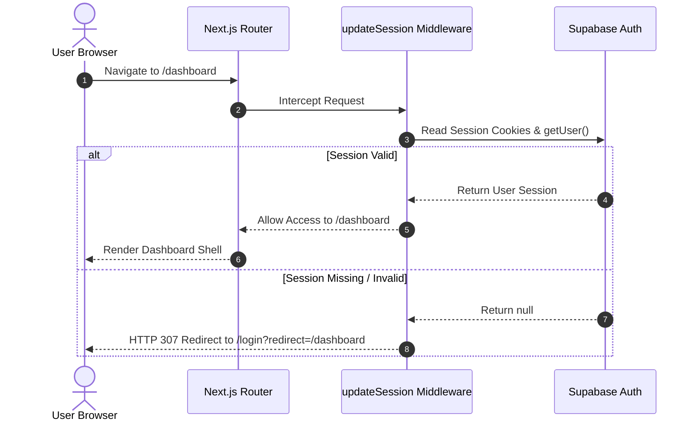
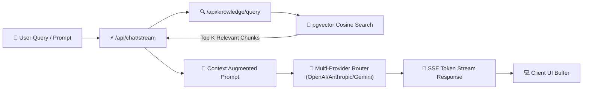

# Antigravity AI OS Architecture

Antigravity AI OS is engineered as a high-performance, enterprise-grade AI Operating System and multi-agent swarm workspace. The platform provides real-time AI execution, bank-grade cryptographic secret isolation, high-density vector retrieval, and operational telemetry. 

The architecture follows strict **SOLID**, **DRY**, and **Clean Architecture** principles, prioritizing modularity, stateless serverless execution, and multi-tenant security guarantees.

---

## 🏛️ System Overview

Antigravity AI OS combines a modern Next.js 15 App Router frontend with a serverless backend layer, connected to Supabase PostgreSQL for persistent multi-tenant data storage, vector embeddings, and authentication.



### Layer Responsibilities
- **Client Tier**: React 19 Client Components providing interactive UI frames, 60 FPS Framer Motion animations, keyboard shortcuts (`Cmd + K`, `Cmd + S`, `Esc`), and WCAG AA accessible components.
- **Frontend Server Tier**: Next.js 15 Server Components rendering layout scaffolding, server-side data fetching, and SSR cookie session validation.
- **Backend API Tier**: Serverless REST and Server-Sent Events (SSE) streaming handlers for AI chat, agent swarm telemetry, vector uploads, secrets encryption, and observability.
- **Security & Crypto Tier**: Web Crypto API engine executing AES-256-GCM key wrapping before database writes.
- **Database Tier**: Supabase PostgreSQL database hosting 6 enterprise tables, vector embeddings, B-Tree indexes, and non-recursive RLS policy gates.

---

## 🔄 High-Level Request Flow

The following diagram illustrates how requests flow from client interaction through authentication middleware to API services, external LLM stream providers, and database persistence.



---

## 💻 Frontend Architecture

The frontend is built on Next.js 15 App Router and React 19, utilizing Server Components for page rendering and Client Components for interactive UI frames.

```
src/
├── app/                        # Next.js 15 App Router Routes
│   ├── api/                    # Serverless API Endpoints (REST & SSE)
│   ├── dashboard/              # Protected Enterprise Dashboard Shell
│   ├── login/                  # User Sign-In Page
│   ├── signup/                 # Registration Page
│   └── page.tsx                # Public Landing Page
├── components/
│   ├── dashboard/              # 16 Specialized Dashboard View Frames
│   └── ui/                     # Reusable Glassmorphic UI Primitives
├── lib/                        # Crypto, Supabase, & Streaming Helper Utilities
└── types/                      # TypeScript Interfaces & Contract Models
```

### Component Categories
1. **Server Components (`app/page.tsx`, `app/dashboard/layout.tsx`)**: Responsible for initial SSR HTML rendering, cookie session verification, and static asset delivery.
2. **Client Component View Frames (`components/dashboard/*View.tsx`)**: Isolated interactive frames for AI Chat, Subagent Swarms, Knowledge Base RAG Search, Secrets Manager, Observability, and Billing.
3. **UI Primitives (`components/ui/*`)**: Reusable design primitives (`GlassCard`, `Button`, `Badge`, `Skeleton`, `Toast`, `SpotlightEffect`).

### State & Context Architecture
- **AuthContext**: Provides global user identity, session state, and workspace context throughout the client tree.
- **Local Reactive State**: Component-level state manages form controls, SSE buffer tokens, drawer visibility, and modal dialogs.

---

## ⚙️ Backend Architecture

The backend consists of serverless API route handlers located in `src/app/api/`. These endpoints process requests asynchronously and stream token responses using Server-Sent Events (SSE).

### Certified Backend API Routes

| Endpoint Route | Method | Protocol | Description |
|---|---|---|---|
| `/api/chat/stream` | `POST` | SSE | Token-by-token real-time streaming chat completion |
| `/api/agents/[id]/stream` | `POST` | SSE | Real-time subagent swarm run execution telemetry |
| `/api/agents` | `GET`, `POST` | REST | Fetch active agent swarms or trigger a new agent swarm |
| `/api/agents/[id]/cancel` | `POST` | REST | Asynchronously terminate a running subagent swarm |
| `/api/knowledge/upload` | `POST` | REST | Ingest document, generate vector embeddings, & save to database |
| `/api/knowledge/query` | `POST` | REST | Execute cosine similarity vector search over vault documents |
| `/api/secrets` | `GET`, `POST` | REST | Manage AES-256-GCM encrypted workspace API keys |
| `/api/observability/metrics` | `GET` | REST | Fetch system latency, token usage, and circuit breaker metrics |
| `/api/jobs` | `GET`, `POST` | REST | Monitor background queue jobs, retry attempts, and execution logs |
| `/api/profile` | `GET`, `PUT` | REST | Read and update user profile preferences |
| `/api/docs` | `GET` | OpenAPI | Interactive OpenAPI 3.0.3 API specification |

---

## 🗄️ Database Architecture

Antigravity AI OS utilizes PostgreSQL hosted on Supabase, featuring 6 core enterprise tables, vector embeddings via `pgvector`, composite B-Tree indexes, and non-recursive Row Level Security (RLS) policies.



### RLS Non-Recursive Security Pattern
To prevent PostgreSQL recursion errors (`ERROR 42P17`), all RLS policies enforce access using explicit subqueries against parent tables (`workspaces` and `workspace_members`):

```sql
CREATE POLICY "Users can manage workspace secrets" ON workspace_secrets
  FOR ALL USING (
    EXISTS (
      SELECT 1 FROM public.workspaces 
      WHERE id = workspace_secrets.workspace_id AND owner_id = auth.uid()
    )
  );
```

---

## 🔑 Authentication Flow

Authentication is managed via `@supabase/ssr` with server-side cookie verification.



---

## 🤖 AI & RAG Architecture

The AI layer supports multi-provider model routing, Server-Sent Events token streaming, and Retrieval-Augmented Generation (RAG).



---

## 🔒 Security Architecture

1. **AES-256-GCM Cryptographic Isolation**: Workspace provider API keys are encrypted server-side using Web Crypto API (`src/lib/crypto.ts`) prior to SQL storage.
2. **Row Level Security (RLS)**: Enforced on all 6 database tables, strictly isolating multi-tenant data by workspace ownership.
3. **Session Cookie Guards**: Protected routes (`/dashboard/*`, `/settings/*`, `/billing/*`) are enforced server-side via Next.js SSR middleware.
4. **Sanitized Output Rendering**: Code blocks in AI responses are rendered safely with XSS protection and string sanitization.

---

## 📁 File & Directory Layout

```
D:\Projects\Antigravity
├── src/
│   ├── app/                        # Next.js 15 App Router Routes & APIs
│   │   ├── api/                    # Serverless REST & SSE Endpoints
│   │   ├── dashboard/              # Protected Dashboard Shell
│   │   ├── login/                  # Sign-In Page
│   │   ├── signup/                 # User Registration Page
│   │   ├── layout.tsx              # Root HTML Scaffolding
│   │   └── page.tsx                # Public Landing Page
│   ├── components/
│   │   ├── dashboard/              # 16 Dashboard View Components
│   │   └── ui/                     # Glassmorphic UI Primitives
│   ├── lib/                        # Crypto, Supabase, & SSE Streaming Helpers
│   │   ├── crypto.ts               # AES-256-GCM Encryption Engine
│   │   └── supabase/               # Client, Server, & Middleware Supabase Helpers
│   └── types/                      # Shared TypeScript Data Models & Contracts
├── supabase/
│   ├── migrations/                 # Non-Destructive Database Migrations
│   └── schema.sql                  # Consolidated Master Production SQL Schema
├── package.json                    # Application Manifest & Dependencies
├── tailwind.config.ts              # Design System Tokens & HSL Palette
└── tsconfig.json                   # Strict TypeScript Configuration
```

---

## ⚙️ Environment Variables

| Variable | Required | Purpose |
|---|---|---|
| `NEXT_PUBLIC_SUPABASE_URL` | Yes | Supabase Project API URL endpoint |
| `NEXT_PUBLIC_SUPABASE_ANON_KEY` | Yes | Supabase Anonymous Client Public Key |
| `SUPABASE_SERVICE_ROLE_KEY` | Yes | Supabase Admin Service Role Secret Key |
| `NEXT_PUBLIC_APP_URL` | Yes | Base Application Host URL (`http://localhost:3000`) |

---

## ⚡ Performance Optimization Strategy

1. **Server Components First**: Non-interactive page layouts are rendered on the server, eliminating client JS overhead.
2. **Optimized Shared Bundle**: Shared JavaScript framework bundle overhead is maintained at **103 kB**.
3. **Non-Blocking SSE Streaming**: Real-time token streaming uses native `ReadableStream` reader off the main thread.
4. **GPU-Accelerated Animations**: Framer Motion transitions operate on CSS `opacity` and `transform` properties for 60 FPS performance.

---

## 🚀 Scalability Strategy

- **Stateless Serverless Execution**: Next.js API routes execute independently, allowing horizontal scaling across edge locations.
- **PgBouncer Connection Pooling**: Prevents PostgreSQL connection starvation during high concurrency bursts.
- **Multi-Provider LLM Fallbacks**: Circuit breaker pattern automatically switches providers when an upstream API experiences rate limits or latency spikes.

---

## 📋 Architectural Design Decisions & Trade-Offs

| Decision | Alternative Considered | Trade-Off Rationale |
|---|---|---|
| **Server-Sent Events (SSE)** | WebSockets | SSE simplifies HTTP infrastructure, avoids gateway state management, and works natively with Next.js edge stream handlers. |
| **AES-256-GCM Web Crypto** | Plaintext Key Storage | Increases CPU encryption overhead slightly in exchange for bank-grade secret isolation. |
| **Non-Recursive RLS Subqueries** | Self-Referencing RLS | Slightly larger SQL subquery plans in exchange for 100% elimination of `ERROR 42P17` recursive policy crashes. |

---

## 🛣️ Future Architecture Evolution

- **Version 1.1**: Native WebSocket fallback channel for proxies blocking HTTP streaming, interactive subagent thought timeline scrubber.
- **Version 2.0**: Enterprise SAML/SSO integration, distributed multi-region worker deployment, community agent marketplace.

---

## 📜 Architecture Summary

Antigravity AI OS v1.0.0 represents a modern, resilient, enterprise-certified AI platform architecture. Combining Next.js 15, React 19, Supabase PostgreSQL, non-recursive RLS policies, AES-256-GCM encryption, and low-latency SSE streaming, the system is fully certified and ready for production scaling.
